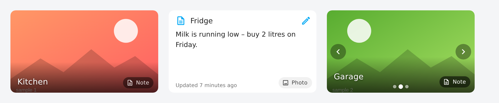
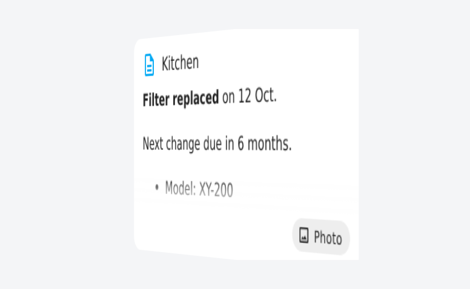

<h1 align="center">Pinboard</h1>

<p align="center">
  Pictures, notes, checklists and voice memos on one dashboard card.<br>
  Tap it and it turns to the next page. A Home Assistant card, installable through HACS.
</p>

Pinboard is the pinboard in the hallway, as a card: the fridge with the
shopping list on its back, the boiler with its last service date, a plant with
its watering schedule, a family photo with a voice memo. The simplest card is a
picture with a note on its back; a tap (or a key press, a hover, or a timer)
turns it over with a 3D flip, a crossfade, a slide or a cube rotation. A card
can hold up to ten pictures, notes and recordings in any order.



<p align="center">
  
</p>

## Features

- **Upload a picture from the editor** — stored by Home Assistant, no `www`
  folder needed. URLs, `/local/` paths, `media-source://` ids and `image`,
  `camera` or `person` entities work too.
- **Notes in Markdown** — bold, lists, links, plus **templates** such as
  `{{ states('sensor.boiler') }}` that follow state changes.
- **To-do lists as pages** — a `todo.*` list becomes a checklist you tick and
  extend on the card. Items carry details, so a list also works as a stack of
  longer notes. Home Assistant keeps the list, so every device, the To-do view
  and automations see the same state.
- **History** — notes from entities show their last changes with time and
  person, straight from Home Assistant's logbook.
- **No Markdown required** — the editor's note box has buttons for bold,
  italic, heading, list, checklist and link, and a live preview.
- **Notes with a shelf life and a colour** — `expires` dims or hides a note
  after a date, `color` tints the page, and the sticky-note look makes notes
  read like a note on the fridge.
- **Edit the note on the card** — link an `input_text` or `text` entity and a
  pencil appears on the note side. Changes are saved with `set_value`, so
  automations and other dashboards see them immediately.
- **Up to ten pictures and notes per card, in any order** — picture, note,
  note, picture … Tap, swipe, arrows, dots, arrow keys or a timer move on to
  the next one. Or show them side by side as tiles that flip independently.
- **Markers on the picture** — numbered pins or icons with a label
  ("here is the stopcock"), optionally showing an entity's state and opening
  its more-info dialog. Placed by clicking in the editor.
- **A camera button on the card** — when a picture comes from an
  `input_text` entity, a tap on the camera takes or picks a new photo, uploads
  it and stores its address in the entity. No editor needed.
- **Voice memos** — an audio page with a player. Record in the editor, upload
  a file, or point `audio_entity` at an `input_text` and record straight on the
  card.
- **Ken Burns** — a slow zoom and pan on pictures for wall panels.
- **Five transitions** — `flip` (3D, default), `fade`, `slide`, `cube`, `none`;
  horizontal or vertical. Respects `prefers-reduced-motion`.
- **Fits every layout** — fixed aspect ratios or the picture's natural size,
  masonry and sections views, phone and wall panel.
- **Visual editor** for every option, grouped into sections. UI in English,
  German, Dutch, French and Spanish. Keyboard access throughout.
- **Try it first**: the [demo page](https://micklesk.github.io/pinboard-card/demo/)
  shows every feature with stand-ins for Home Assistant.

## Installation

### HACS

1. Open HACS, three-dot menu, **Custom repositories**.
2. Add `https://github.com/MickLesk/pinboard-card`, category **Dashboard**.
3. Install **Pinboard** and reload the browser when HACS asks.

HACS registers the resource automatically. If you manage resources yourself,
add `/hacsfiles/pinboard-card/pinboard-card.js` as a *JavaScript module*.

### Manual

Copy `dist/pinboard-card.js` to `/config/www/pinboard-card.js` and add
`/local/pinboard-card.js` under **Settings → Dashboards → Resources** as a
*JavaScript module*.

Requires Home Assistant 2024.10 or newer.

## Quick start

Add the card from the card picker (**Pinboard Card**) and use the visual
editor, or paste YAML. The smallest useful card is a picture with a note on
its back:

```yaml
type: custom:pinboard-card
title: Boiler
image: /local/pictures/boiler.jpg
note: |
  **Last service:** 12 Oct 2025
  Next filter change in six months.
```

## Full configuration

Every option, with its default where one exists. Only `type` is required.

```yaml
type: custom:pinboard-card
title: Garage                      # shown on pictures and above notes

# --- pages ------------------------------------------------------------------
# Up to ten pictures, notes and recordings in any order. An entry with several
# parts becomes one page per part (picture, note, audio). For a single entry
# you can put its keys on the card itself instead of under slides.
slides:
  - image: /local/pictures/bike.jpg          # URL, /local/ path, /api/image/serve/… or media-source:// id
    title: Bike                              # optional, falls back to the card title
    note: |                                  # Markdown, checklists and templates
      Chain oiled in March.
      - [ ] Pump the tyres
      - [x] Fix the light
    markers:                                 # pins on the picture
      - x: 30                                # percent of the width
        y: 45                                # percent of the height
        label: Stopcock
        icon: mdi:water-off                  # optional; a number without it
        entity: sensor.garage_temperature    # optional; state in the label, tap opens more-info
  - image_entity: camera.garage              # picture from an image, camera or person entity,
                                             # or an input_text / text holding a picture address
    title: Live view
  - note_entity: input_text.garage_note      # note from an entity; editable on the card
    note_attribute: ""                       # read an attribute instead of the state (read-only)
  - todo_entity: todo.garage                 # a to-do list as a checklist page
    note: "Before the weekend:"              # optional text above the list
    color: yellow                            # yellow, green, blue, pink, orange, purple, grey or any CSS colour
    text_color: auto                         # auto (contrast to the page colour), light, dark or any CSS colour
    expires: "2026-10-01 18:00"              # afterwards dimmed and tagged, or hidden (expired_slides)
  - audio: media-source://media_source/local/pinboard/memo.webm   # a recording or any audio file
    title: Voice memo
  - audio_entity: input_text.garage_memo     # audio from an entity; record button on the card
    kind: audio                              # only needed for an entry without content yet
  - image_entity: camera.driveway
    title: Someone is there
    visible:                                 # shown only while the condition holds
      entity: binary_sensor.driveway_motion
      state: "on"
    hold_action:                             # per-page override of the card's actions
      action: more-info
      entity: camera.driveway

# --- layout ----------------------------------------------------------------
layout: stack                      # stack: one page after another | grid: entries side by side as tiles
columns: 0                         # grid: tiles per row, 0 fits as many as the width allows
aspect_ratio: "16:9"               # 16:9, 4:3, 3:2, 1:1, 3:4, 9:16, any w:h, or auto
image_fit: cover                   # cover (fill and crop) | contain (whole picture)

# --- animation -------------------------------------------------------------
transition: flip                   # flip | fade | slide | cube | none
direction: horizontal              # horizontal | vertical
duration: 700                      # milliseconds
default_side: image                # image: start on the first picture | note: start on the first note
auto_flip: 0                       # seconds between automatic page turns, 0 = off
hover_flip: false                  # show the next page while the pointer hovers (mouse only)
swipe: true                        # swiping on the card turns pages and is kept from dashboard swipe navigation
ken_burns: false                   # slow zoom and pan on pictures

# --- appearance ------------------------------------------------------------
show_title: true                   # title overlay on pictures
show_hint: true                    # the "Note" / "Photo" / "Audio" badge in the corner
show_navigation: true              # arrows and dots when there are more than two pages
show_updated: true                 # "Updated 5 minutes ago" for notes and recordings from entities
note_style: plain                  # plain | sticky
expired_slides: dim                # dim: greyed out with an "Expired" tag | hide: removed from the sequence

# --- notes and to-do lists -------------------------------------------------
checklist: true                    # "- [ ] item" lines become checkboxes
checklist_writeback: true          # save ticks to input_text / text entities
todo_add: true                     # input row on to-do pages for new items
todo_show_completed: true          # keep completed to-do items visible, struck through
show_history: true                 # history button on notes from entities

# --- uploads (editor upload button, camera and record buttons) -------------
upload_target: image               # image: Home Assistant's image store (/config/image) | media: the media folder
upload_folder: pinboard            # media target: folder below /media, created on the first upload
upload_max_size: 1920              # longest edge in pixels pictures are scaled down to, 0 keeps originals
upload_crop: false                 # centre-crop uploads to aspect_ratio
show_camera: true                  # camera button on pictures from an input_text / text entity
show_record: true                  # record button on audio pages from an input_text / text entity

# --- actions ---------------------------------------------------------------
tap_action:
  action: flip                     # flip | more-info | toggle | navigate | url | perform-action | none
hold_action:
  action: more-info                # entity defaults to the page's note_entity, then image_entity
double_tap_action:
  action: perform-action
  perform_action: input_text.set_value
  target:
    entity_id: input_text.garage_note
  data:
    value: ""
  confirmation:
    text: Clear the note?
```

## Options

### Card

| Option | Default | Description |
| --- | --- | --- |
| `type` | – | `custom:pinboard-card`. Required. |
| `title` | – | Shown on pictures and above notes. Pages without their own `title` use it. |
| `slides` | – | Pictures, notes and recordings in order, at most ten pages. See [Page](#page). `images` is accepted as an older name. |
| `image`, `image_entity`, `note`, `note_entity`, `note_attribute`, `audio`, `audio_entity`, `expires`, `color`, `markers`, `kind` | – | The single-entry form: the same keys as one `slides` entry, placed on the card. Ignored when `slides` is set. |
| `layout` | `stack` | `stack` shows one page after another, `grid` shows the entries side by side as tiles that each turn on their own. |
| `columns` | `0` | With `layout: grid`: tiles per row. `0` fits as many as the width allows (about 150 px each). |
| `aspect_ratio` | `16:9` | `16:9`, `4:3`, `3:2`, `1:1`, `3:4`, `9:16`, any `w:h`, or `auto` for the picture's natural size. In sections view the card fills its rows instead. |
| `image_fit` | `cover` | `cover` fills the card and crops, `contain` shows the whole picture. |
| `transition` | `flip` | `flip`, `fade`, `slide`, `cube` or `none`. Replaced by a short fade when the system asks for reduced motion. |
| `direction` | `horizontal` | `horizontal` or `vertical`, for `flip`, `slide` and `cube`. |
| `duration` | `700` | Animation length in milliseconds. |
| `default_side` | `image` | Start on the first picture (`image`) or the first note (`note`). |
| `auto_flip` | `0` | Turn to the next page every *n* seconds. `0` disables it. `auto_advance` is an older name. |
| `hover_flip` | `false` | Show the next page while the pointer hovers over the card. Mouse devices only. |
| `swipe` | `true` | Swiping left and right on the card turns pages. The card keeps those touches to itself, so swipe-navigation plugins do not change the view instead. Set to `false` to let swipes over the card reach the dashboard. |
| `ken_burns` | `false` | Slow zoom and pan on pictures. Off under "reduce motion". |
| `show_title` | `true` | Title overlay on pictures. |
| `show_hint` | `true` | The badge in the corner that names the next page. |
| `show_navigation` | `true` | Arrows and dots when there are more than two pages. Swiping and the arrow keys always work. |
| `show_updated` | `true` | "Updated … ago" for notes and recordings that come from an entity. |
| `note_style` | `plain` | `plain` or `sticky`. Sticky notes get a paper tint and a folded corner. |
| `expired_slides` | `dim` | What happens to pages past their `expires`: `dim` keeps them greyed out with an "Expired" tag, `hide` removes them from the sequence. |
| `checklist` | `true` | Lines like `- [ ] item` become checkboxes. Ticks are saved for notes from an `input_text` / `text` entity; in notes from the card config the boxes are read-only. |
| `checklist_writeback` | `true` | Save ticks on notes from an `input_text` or `text` entity to the entity. |
| `todo_add` | `true` | Input row on to-do pages for adding items. |
| `todo_show_completed` | `true` | Keep completed to-do items visible below the open ones, struck through. |
| `show_history` | `true` | History button on notes from entities: the last changes with time and person, from the logbook. |
| `upload_target` | `image` | Where the editor's upload button and the camera and record buttons store files: `image` (Home Assistant's image store) or `media` (the media folder). Audio always goes to the media folder. |
| `upload_folder` | `pinboard` | With `upload_target: media`: the folder below `/media`. Created on the first upload. |
| `upload_max_size` | `1920` | Longest edge in pixels that pictures are scaled down to before upload. `0` keeps originals. |
| `upload_crop` | `false` | Centre-crop pictures to `aspect_ratio` before upload. |
| `show_camera` | `true` | Camera button on pictures whose `image_entity` is an `input_text` / `text` entity. |
| `show_record` | `true` | Record button on audio pages whose `audio_entity` is an `input_text` / `text` entity. |
| `tap_action` | `flip` | Action for a tap. See [Action](#action). |
| `hold_action` | `none` | Action for a long press. |
| `double_tap_action` | `none` | Action for a double tap. Only when set is a double tap awaited, so a single tap stays instant otherwise. |

### Page

One entry of `slides`, or the single-entry keys on the card. An entry with a
picture, a note and a recording yields three pages, in that order. A bare
string is treated as `image`.

| Option | Default | Description |
| --- | --- | --- |
| `title` | card `title` | Title of this page. |
| `image` | – | Picture URL, `/local/` path, `/api/image/serve/…` URL or `media-source://` id. Uploads from the editor land here. |
| `image_entity` | – | Picture from an `image`, `camera` or `person` entity, or from an `input_text` / `text` entity whose state is a picture address. The latter gets a camera button. |
| `note` | – | The note in Markdown. Checklists and templates work. Ignored when `note_entity` is set. |
| `note_entity` | – | Note from an entity's state. `input_text` and `text` entities are editable on the card. |
| `note_attribute` | – | Read this attribute of `note_entity` instead of its state. Read-only. |
| `todo_entity` | – | A `todo.*` list shown as a checklist. Ticks and new items go to the list. `note` becomes the text above it. |
| `audio` | – | URL or `media-source://` id of an audio file. |
| `audio_entity` | – | Audio from an `input_text` / `text` entity whose state is the audio address. Gets a record button. |
| `expires` | – | `2026-10-01` or `2026-10-01 18:00`. Until then the footer shows "Until …"; afterwards the page is dimmed or hidden. |
| `color` | – | Tint of a note page: `yellow`, `green`, `blue`, `pink`, `orange`, `purple`, `grey` or any CSS colour. |
| `text_color` | `auto` | Text on a note page: `auto` picks dark or light for contrast with `color`, `light` and `dark` force it, any CSS colour works too. |
| `markers` | – | A list of pins on the picture. See [Marker](#marker). |
| `kind` | – | `image`, `note` or `audio`. Only needed for an entry that has no content yet; the editor sets it. |
| `visible` | – | One condition or a list: `{ entity, state }`, `{ entity, state_not }` or `{ entity, attribute, state }`. `state` may be a list. Without `state` the page shows whenever the entity is available. The page is only part of the sequence while every condition holds. |
| `tap_action`, `hold_action`, `double_tap_action` | card's | Per-page overrides of the card's actions. |

### Marker

| Option | Default | Description |
| --- | --- | --- |
| `x`, `y` | – | Position in percent of the picture's width and height. Required. |
| `label` | – | Text shown when the pin is tapped. |
| `icon` | – | An `mdi:` icon instead of the number. |
| `entity` | – | Its state is added to the label; a tap on the label opens the more-info dialog. |

### Action

The same objects Home Assistant's own cards use, plus `flip`.

| `action` | Effect |
| --- | --- |
| `flip` | Show the next page. Default for `tap_action`. |
| `more-info` | Open the more-info dialog of `entity`, defaulting to the page's `note_entity`, then `image_entity`. |
| `toggle` | Toggle `entity` (same default). |
| `navigate` | Go to `navigation_path`; `navigation_replace: true` replaces the history entry. |
| `url` | Open `url_path` in a new tab. |
| `perform-action` | Run `perform_action` with `data` and `target`. `call-service` with `service` still works. |
| `none` | Nothing. |

`confirmation: true` or `confirmation: { text: "…" }` asks before an action
runs.

## Documentation

| Page | Contents |
| --- | --- |
| [Pages and content](docs/content.md) | Pictures, notes, checklists, templates, expiry, colours, markers, photos and voice memos on the card, several pages, tiles |
| [Actions](docs/actions.md) | Tap, hold and double tap, examples |
| [The editor and uploads](docs/editor.md) | Entries, ordering, upload targets, folder import, markers, recording, preview |
| [Styling and sizing](docs/styling.md) | CSS variables, sections and masonry views, small cards |
| [Contributing](CONTRIBUTING.md) | Repository layout, branches, pull requests, releases |

## Ideas for later

- A companion integration that keeps notes with their history, author and
  timestamp and offers services for automations.
- Actions on a note page: mark done, snooze, open a task.
- Reading notes aloud through Assist.
- A QR code that opens the card on a phone.

## License

MIT
